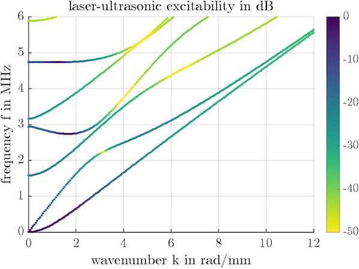
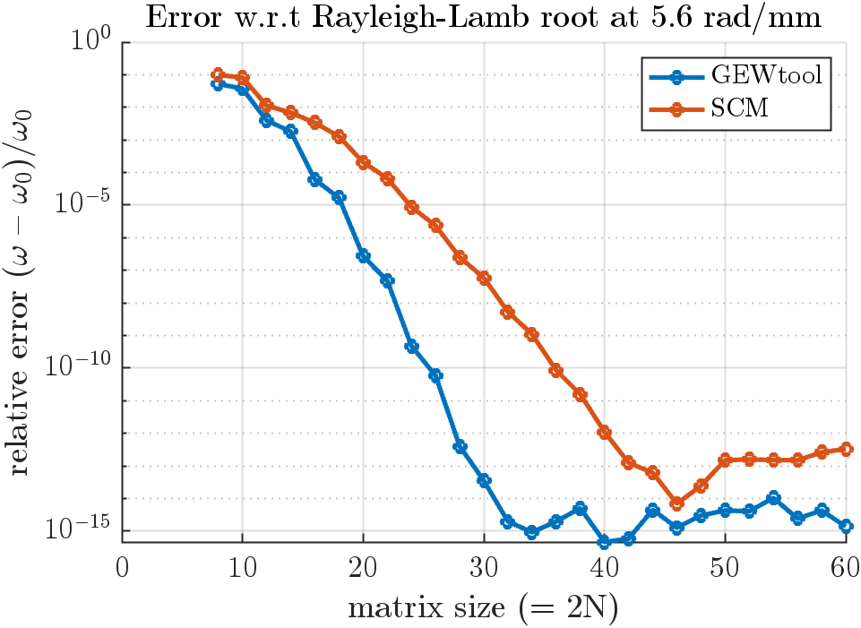

# GEWtool

**Dispersion curves and computation with guided elastic waves (GEWs) in MATLAB.**

`GEWtool` provides extremely fast and reliable computation of guided elastodynamic waves (GEWs) in plates and cylinders. It is simple to use and yet provides full access to the computational results as well as the underlying code. You are welcome to contribute to this open source project.

**Features**:

- Multi-layered plates and cylinders
- Finds all solutions, super fast 
- General anisotropy, dissipation
- Compute real frequencies, complex wavenumbers or ZGV points
- Choose polarization (Lamb/SH/coupled) and symmetry (S/A)

Code repository: [](https://github.com/dakiefer/GEWtool) [https://github.com/dakiefer/GEWtool](https://github.com/dakiefer/GEWtool)

## Example: Lamb waves

```matlab
mat = Material('steel');         % load from database (or create your own)
h = 1e-3;                        % thickness in m
N = 12;                          % number of nodes (dictates accuracy)
k = linspace(1e-2, 12, 100)/h;   % wavenumbers to solve for
plate = Plate(mat, h, N);        % create waveguide description 
gews = plate.LambSA; tic;        % choose S+A Lamb waves (assembles matrices)
dat = computeW(gews, k, 4); toc; % solve and save 4 modes (argument optional)
plot(dat(1).k, dat(1).w/2/pi, 'b'); hold on;        % plot symmetric
plot(dat(2).k, dat(2).w/2/pi, 'r'); ylim([0, 6e6]); % plot anti-symmetric
xlabel('wavenumber k in rad/m'), ylabel('frequency f in Hz')
```

output:
`> Elapsed time is 0.010129 seconds.` 


Proceed by inspecting the laser-ultrasonic excitability of the waves computed above (product of tangential and normal displacements ux·uy):

```matlab
k = linspace(1e-2, 12, 200)/h;          % use more wavenumbers
gew = plate.Lamb;                       % choose all Lamb waves
dat = computeW(gew, k, 7);              % compute
exc = excitabilityLUS(gew, dat, 'top'); % ux*uy at top surface (value of 1 at 100x median)
exc = 20*log10(exc);                    % in decibel
scatter(dat.k(:)/1e3, dat.w(:)/2/pi/1e6, 15, exc(:), 'filled'), ylim([0, 6]);
colormap(flipud(colormap)); cb = colorbar; caxis([-50, 0]);
xlabel('wavenumber k in rad/mm'), ylabel('frequency f in MHz')
title('laser-ultrasonic excitability in dB')
```



## Installation 

Add `GEWtool` and its subfolders to the Matlab path and save for future sessions. You can achieve this by 
1. changing to the `GEWtool` folder (e.g., using `cd`)
2. copy and past the following code:
```matlab
installdir = pwd;
addpath(fullfile(installdir, 'GEWdat'));
addpath(fullfile(installdir, 'layers'));
addpath(fullfile(installdir, 'material'));
addpath(fullfile(installdir, 'material/database'));
addpath(fullfile(installdir, 'resourcesAndDeps'));
addpath(fullfile(installdir, 'solvers'));
addpath(fullfile(installdir, 'utilitiesAndNumerics'));
addpath(fullfile(installdir, 'waveguides'));
savepath % make permanent
```
Enjoy!

## Getting started

To get started, explore the `examples` directory. 

You can also display help for all functions and classes, e.g., by typing `help Plate`. The most important ones are

- Material representation: `Material`, `MaterialIsotropic`
- Waveguides:  `Plate`, `Cylinder`
- Solvers: `computeW`, `computeK`, `computeZGV`

## Mathematical and physical background

GEWtool implements the *Spectral Element Method (SEM)* (higher-order Finite Elements) to solve the *waveguide problem*, i.e., the boundary value problem that describes wave propagation in the structure. Such an approach is commonly qualified as 'semi-analytical'. Contrary to classical root-finding of the characteristic equation, this method does not miss solutions. Moreover, in contrast to Finite Elements, the Spectral Elements lead to small but dense matrices. 

Solusions are computed with machine precision provided you have set the discretization order `N` sufficiently high. The higher you go in frequency-thickness, the higher `N`  should be. As a rule of thumb: half of the obtained modes will be accurate. The figure below shows the convergence with respect to the Rayleigh-Lamb root of the S1 mode at 5.6 rad/mm in an aluminum plate (solution close to 5 MHz mm). A [Spectral Collocation](https://github.com/dakiefer/GEW_dispersion_script) implementation is shown in comparison. 15 digits accuracy is attained with N = 16 in this case.



For general information on the theory of elastic guided wave propagation refer to 
> D. A. Kiefer, _Elastodynamic quasi-guided waves for transit-time ultrasonic flow metering_, ser. FAU Forschungen, Reihe B, Medizin, Naturwissenschaft, Technik, vol. 42. Erlangen: FAU University Press, 2022, doi: [10.25593/978-3-96147-550-6](http://doi.org/10.25593/978-3-96147-550-6). [](https://dakiefer.net/publication/2022_dissertation_elastodynamic-quasi-guided-waves/2022_dissertation_Elastodynamic%20quasi-guided%20waves.pdf)

## Dependencies

GEWtool depends on the functions `collocD` and `lglnodes` created by Greg von Winckel. They are bundled together with their license files in the `resourcesAndDeps` directory. You may also find them on
> Greg von Winckel, MATLAB Central File Exchange, https://fr.mathworks.com/matlabcentral/profile/authors/869721.

The function `computeZGVDirect` depends on the `MultiParEig toolbox` by Bor Plestenjak and Andrej Muhič: 
> Bor Plestenjak (2022). MultiParEig (https://www.mathworks.com/matlabcentral/fileexchange/47844-multipareig), MATLAB Central File Exchange.

## Author

2022–2023 – Daniel A. Kiefer, Institut Langevin, ESPCI Paris | PSL.

I have several years of experience in waveguide modeling and numerical implementations thereof. In January 2022 I decided to create a new modular and versatile code from scratch. The result is GEWtool. My hope is that it be a valuable research tool and at the same time a helpful educational resource for those interested in numerical methods and elastic waves.

Contact: [daniel.kiefer@espci.fr](mailto:daniel.kiefer@espci.fr) &nbsp; ● &nbsp; [dakiefer.net](https://dakiefer.net) &nbsp; ● &nbsp; Follow me on [ResearchGate](https://www.researchgate.net/profile/Daniel-Kiefer-5)!

[](https://www.institut-langevin.espci.fr) &nbsp;&nbsp;&nbsp;&nbsp;&nbsp;&nbsp; [](https://www.espci.psl.eu/en/)
