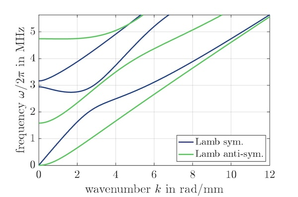

# GEWtool [](https://doi.org/10.5281/zenodo.10114243)


**Compute guided elastic wave (GEW) dispersion in MATLAB.**

`GEWtool` is an advanced system to compute and postprocess guided elastodynamic waves (GEWs) in plates and cylinders. It is simple to use yet provides full access to the computational results as well as the underlying code. You are welcome to contribute to this open-source project.

**Features**:

- multi-layered plates, tubes and rods
- anisotropy, piezoelectricity, dissipation
- super fast, guarantees to find all solutions
- compute real frequencies, complex wavenumbers, or ZGV points
- choose polarization (Lamb/SH/coupled) and parity (S/A)

[](https://github.com/dakiefer/GEWtool) Code repository: [https://github.com/dakiefer/GEWtool](https://github.com/dakiefer/GEWtool)

> [!WARNING]
> **v2.0 introduces the following backward-incompatibilities**:
>
> - directory structure updated: you will need to re-run `install.m` after updating to v2.0.
> - `rotateEuler()` changed from extrinsic to intrinsic rotations! Reverse the order of rotation sequences in your old scripts to get the same results as with older GEWtool versions. 
>   See `help rotateEuler` for more information.
> - changed coordinate system
>   - plate: ex-ey-ez system: ex is propagation direction, _ez is normal_ to the plate surface (previously, this was ey)
>   - cylinder: ex-ephi-er system: ex is propagation direction, er is the radial direction
> - solver functions: return a `GEWdat` object instead of a `struct`

> [!NOTE]
> **Coming soon**:
>
> - Leaky waves
> 
> Contact me if you have questions:  [daniel.kiefer@espci.fr](mailto:daniel.kiefer@espci.fr)

## Example: Lamb waves

```matlab
mat = Material('steel');         % load from database (or create your own)
h = 1e-3;                        % thickness in m
N = 12;                          % number of nodes (dictates accuracy)
k = linspace(1e-2, 12, 100)/h;   % wavenumbers to solve for
plate = Plate(mat, h, N);        % create waveguide description 
gews = plate.LambSA; tic;        % choose S+A Lamb waves (assembles matrices)
dat = computeW(gews, k, 4); toc; % solve and save 4 modes (argument optional)
plot(dat); 											 % plot dispersion curves
```

output:
`> Elapsed time is 0.010129 seconds.` 



Proceed by inspecting the laser-ultrasonic excitability of the waves computed above (product of tangential and normal displacements ux·uz):

```matlab
k = linspace(1e-2, 12, 200)/h;          % use more wavenumbers
gew = plate.Lamb;                       % choose all Lamb waves this time
dat = computeW(gew, k, 7);              % compute
exc = excitabilityLUS(dat, 'top'); % vx*uz at top surface (value of 1 at 100x median)
exc = 20*log10(exc);                    % in decibel
scatter(dat.k(:)/1e3, dat.w(:)/2/pi/1e6, 15, exc(:), 'filled'), ylim([0, 6]);
colormap(flipud(colormap)); cb = colorbar; caxis([-50, 0]);
xlabel('wavenumber k in rad/mm'), ylabel('frequency f in MHz')
title('laser-ultrasonic excitability in dB')
```


## Installation 

Add `GEWtool` and the relevant subfolders to the Matlab path and save it for future sessions. To achieve this:

1. change to the `GEWtool` folder (e.g., by navigating or using `cd`)
2. execute `install`

Enjoy!

## Getting started

To get started, explore the `examples` directory. 

You can also display help for all functions and classes, e.g., by typing `help Plate`. The most important ones are

- Material representation: `Material`, `MaterialIsotropic`
- Waveguides:  `Plate`, `Cylinder`, `CylinderCircumferential`
- Solvers: `computeW`, `computeK`, `computeZGV`

## Known limitations 

- Circumferential waves: post-processing is not fully supported. While group velocity is working, energy velocity cannot be computed at the moment. 

## Mathematical and physical background

GEWtool implements the *Spectral Element Method (SEM)* (higher-order Finite Elements) to solve the *waveguide problem*, i.e., the boundary value problem that describes wave propagation in the structure. Such an approach is commonly qualified as 'semi-analytical'. Contrary to classical root-finding of the characteristic equation, this method does not miss solutions. Moreover, unlike Finite Elements, the Spectral Elements lead to small but dense matrices. 

Solusions are computed with machine precision provided you have set the discretization order `N` sufficiently high. The higher you go in frequency-thickness, the higher `N`  should be. As a rule of thumb: half of the obtained modes will be accurate. The figure below shows the convergence with respect to the Rayleigh-Lamb root of the S1 mode at 5.6 rad/mm in an aluminum plate (solution close to 5 MHz mm). A [Spectral Collocation](https://github.com/dakiefer/GEW_dispersion_script) implementation is shown in comparison. GEWtool attains 13 digits accuracy with N = 16 in this case.


For more  information on the waveguide problem and the numerical methods, refer to the literature cited in the sections below.

## Dependencies

GEWtool depends on the functions `barylag`, `collocD` , `lglnodes` and `lgwt` created by Greg von Winckel. They are bundled together with their license files in the `resourcesAndDeps` directory. You may also find them on

> Greg von Winckel, MATLAB Central File Exchange, [https://fr.mathworks.com/matlabcentral/profile/authors/869721](https://fr.mathworks.com/matlabcentral/profile/authors/869721).

The function `computeZGVDirect` depends on the `MultiParEig toolbox` by Bor Plestenjak and Andrej Muhič: 

> Bor Plestenjak (2022). MultiParEig ([https://www.mathworks.com/matlabcentral/fileexchange/47844-multipareig](https://www.mathworks.com/matlabcentral/fileexchange/47844-multipareig)), MATLAB Central File Exchange.

The function `legendUnq` by Adam Danz is used in the example scripts: 

> Adam Danz (2024). legendUnq ([https://www.mathworks.com/matlabcentral/fileexchange/67646-legendunq](https://www.mathworks.com/matlabcentral/fileexchange/67646-legendunq)), MATLAB Central File Exchange.

## Citing GEWtool

If this code is useful to you, please cite it as (always indicating the DOI):

> D. A. Kiefer (2023). GEWtool. [https://doi.org/10.5281/zenodo.10114243](https://doi.org/10.5281/zenodo.10114243) ([https://github.com/dakiefer/GEWtool](https://github.com/dakiefer/GEWtool))

Please also cite the related publication(s) as relevant, e.g., 

> [1] D. A. Kiefer, S. Mezil, and C. Prada, “Beating resonance patterns and extreme power flux skewing in anisotropic elastic plates,” Science Advances, vol. 9, no. 51, p. eadk6846, Dec. 2023, doi: [10.1126/sciadv.adk6846](http://doi.org/10.1126/sciadv.adk6846). [](https://dakiefer.net/publication/2023_sciadv_beatingresonances/2023_SciAdv_BeatingResonances.pdf).  
> [2] H. Gravenkamp, B. Plestenjak, and D. A. Kiefer, “Notes on osculations and mode tracing in semi-analytical waveguide modeling,” Ultrasonics, vol. 135, p. 107112, Jul. 2023, doi: [10.1016/j.ultras.2023.107112](http://doi.org/10.1016/j.ultras.2023.107112). [](https://dakiefer.net/publication/2023_gravenkamp_osculations/2023_Gravenkamp_Osculations.pdf).  
> [3] D. A. Kiefer, B. Plestenjak, H. Gravenkamp, and C. Prada, “Computing zero-group-velocity points in anisotropic elastic waveguides: Globally and locally convergent methods,” The Journal of the Acoustical Society of America, vol. 153, no. 2, pp. 1386–1398, Feb. 2023, doi: [10.1121/10.0017252](http://doi.org/10.1121/10.0017252). [](https://dakiefer.net/publication/2023_JASA_Computing_ZGV/2023_JASA_Computing_ZGV.pdf).

## Further literature 

> [1] T. J. R. Hughes, _The Finite Element Method: Linear Static and Dynamic Finite Element Analysis_. Mineola, New York: Dover Publications, 2012.  
> [2] G. Waas, _Linear two dimensional analysis of soil dynamics problems in semi-infinite layered media_, Ph. D. thesis, University of California, Berkley, 1972.  
> [3] E. Kausel and J. M. Roësset, “Semianalytic Hyperelement for Layered Strata,” Journal of the Engineering Mechanics Division, vol. 103, no. 4, Aug. 1977, doi: [10.1061/JMCEA3.0002251](https://doi.org/10.1061/JMCEA3.0002251).  
> [4] L. Gavrić, “Finite Element Computation of Dispersion Properties of Thin-Walled Waveguides,” Journal of Sound and Vibration, vol. 173, no. 1, May 1994, doi: [10.1006/jsvi.1994.1221](https://doi.org/10.1006/jsvi.1994.1221).  
> [5] A. T. I. Adamou and R. V. Craster, “Spectral methods for modelling guided waves in elastic media,” The Journal of the Acoustical Society of America, vol. 116, no. 3, Sep. 2004, doi: [10.1121/1.1777871](https://doi.org/10.1121/1.1777871).  
> [6] S. Finnveden, “Evaluation of modal density and group velocity by a finite element method,” Journal of Sound and Vibration, vol. 273, no. 1, May 2004, doi: [10.1016/j.jsv.2003.04.004](https://doi.org/10.1016/j.jsv.2003.04.004).  
> [7] A. Marzani, E. Viola, I. Bartoli, F. Lanza di Scalea, and P. Rizzo, “A semi-analytical finite element formulation for modeling stress wave propagation in axisymmetric damped waveguides,” Journal of Sound and Vibration, vol. 318, no. 3, Dec. 2008, doi: [10.1016/j.jsv.2008.04.028](https://doi.org/10.1016/j.jsv.2008.04.028).  
> [8] H. Gravenkamp, C. Song, and J. Prager, “A numerical approach for the computation of dispersion relations for plate structures using the Scaled Boundary Finite Element Method,” Journal of Sound and Vibration, vol. 331, no. 11, May 2012, doi: [10.1016/j.jsv.2012.01.029](https://doi.org/10.1016/j.jsv.2012.01.029).  
> [9] H. Gravenkamp, A. A. Saputra, and S. Duczek, “High-Order Shape Functions in the Scaled Boundary Finite Element Method Revisited,” Arch. Comput. Method Eng., vol. 28, no. 2, Mar. 2021, doi: [10.1007/s11831-019-09385-1](https://doi.org/10.1007/s11831-019-09385-1).  
> [10] D. A. Kiefer, _Elastodynamic quasi-guided waves for transit-time ultrasonic flow metering_, ser. FAU Forschungen, Reihe B, Medizin, Naturwissenschaft, Technik, vol. 42. Erlangen: FAU University Press, 2022, doi: [10.25593/978-3-96147-550-6](http://doi.org/10.25593/978-3-96147-550-6). [](https://dakiefer.net/publication/2022_dissertation_elastodynamic-quasi-guided-waves/2022_dissertation_Elastodynamic%20quasi-guided%20waves.pdf)

## Contributors

**Daniel A. Kiefer**, Institut Langevin, ESPCI Paris, Université PSL  
Author and developer

**Bor Plestenjak**, Faculty of Mathematics and Physics, University of Ljubljana, Slovenia  
Numerical methods to compute ZGV points

**Gatien Clement**,  Institut Langevin, ESPCI Paris, Université PSL  
Homogenization, quaternions, rotation angles

Acknowledgments - Many inspiring discussions influenced GEWtool. D. A. Kiefer is thankful to:   
Hauke Gravenkamp, Pierre Chantelot, Claire Prada, Clemens Grünsteidl and Michael Ponschab

## Author

2022–2025 – Daniel A. Kiefer, Institut Langevin, ESPCI Paris, Université PSL.

I have several years of experience in waveguide modeling and numerical implementations thereof. In January 2022 I decided to create a new modular and versatile code from scratch. The result is GEWtool. My hope is that it be a valuable research tool and at the same time a helpful educational resource for those interested in numerical methods and elastic waves.

Contact: [daniel.kiefer@espci.fr](mailto:daniel.kiefer@espci.fr) &nbsp; • &nbsp; [dakiefer.net](https://dakiefer.net) &nbsp; • &nbsp; Follow me on [ResearchGate](https://www.researchgate.net/profile/Daniel-Kiefer-5)!

[](https://www.institut-langevin.espci.fr)&nbsp;&nbsp;&nbsp;&nbsp;&nbsp;&nbsp;[](https://www.espci.psl.eu/en/)